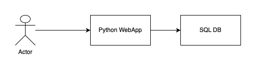
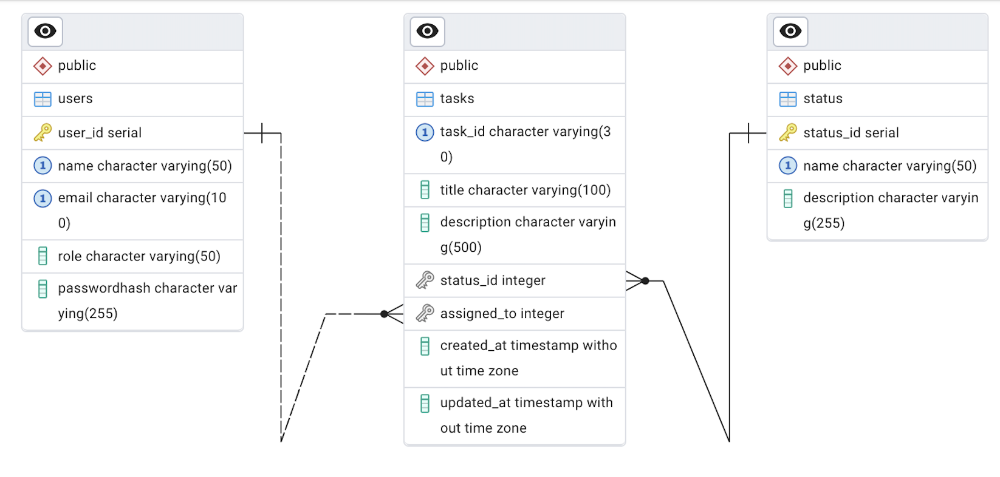

# Design Documentation for TaskMaster

## 1. Introduction

### Project Overview

- Build the web based application which manages the different stages for tasks.
- This application will offer a clear and simplified view of task progress for management team by organizing tasks into distinct stages including To-Do, Doing, and Done.

### Scope(Phase-1)

- **Included:**
  - Task creation and tracking through stages.
  - User assignment, roles and permissions using REST API.
- **Excluded:**
  - Graphical User Interface.
  - Support for multiple projects.
  - API's for reports like tasks by stages/users.
  - Addition and removal for stages

## 2. Functional Requirements

### Feature List

- **Task Management:**

  - Create, edit, and delete tasks.
  - Assign tasks to user.
- **Task State Changes:**

  - Allow user to change the task stage.
  - No restriction/validation for stage transition
- **User Roles:** Define roles such as Admin, Manager, and User with specific permissions.

### User Roles and Permissions

- **Admin:** Full access to manage tasks and users.
- **Manager:** Full access to manage tasks. No permission to manage the users.
- **User:** Create and update tasks assigned to them.

## 3. Non-Functional Requirements

### Performance

- The application should update task status in real-time with minimal latency.

### Scalability

- Capable of handling a growing number of tasks and users without significant performance degradation.

### Security

- Secure user authentication and authorization.

### Usability

- Swagger API documentation with proper description for API's and fields.
- Python SDK for API integration.

## 4. Architecture Design

### System Architecture

- **Python Web-App:** Python with FastAPI for handling server-side logic and API endpoints.
- **Database:** MySQL for storing tasks, user data, and project information.
  

### Technology Stack

- **Back-End:** Python, FastAPI
- **Database:** MySQL/Postgres

### Data Flow

- User will commununicate with the server using swagger, postman or REST SDK/utilities. The server processes requests and interacts with the database to store and retrieve information.

## 5. Database Design

### Schema Design



- **Tasks Collection:**

  - `taskId`: Unique identifier
  - `title`: Task title
  - `description`: Detailed task description
  - `status`: Current stage (To-Do, Doing, Done)
  - `assignedTo`: User ID of the assignee
  - `createdAt`: Timestamp of task creation
  - `updatedAt`: Timestamp of last update
- ***Users Collection:***

  - `userId`: Unique identifier
  - `username`: User's name
  - `email`: User's email address
  - `role`: User's role (Admin, Manager, User)
  - `passwordHash`: Encrypted password

## 7. API Design

### API Endpoints

- **GET /task/all:** Retrieve a list of all tasks. Additinal optional filtyers will be available for project, user, stage.

  - Response payload:

  ```json
  {
  "limit": 0,
  "offset": 0,
  "total": 0,
  "results": [
      {
  	"created_at": "string",
  	"updated_at": "string",
  	"title": "string",
  	"status": "string",
  	"assigned_to": "string",
  	"description": "string",
  	"task_id": 0
      }
    ]
  }
  ```
- **POST /task:** Create a new task.

  - Request Payload

  ```json
  {
  "title": "string",
  "status": "string",
  "assigned_to": "string",
  "description": "string"
  }
  ```

  - Response Payload

  ```json
  {
    "created_at": "string",
    "updated_at": "string",
    "title": "string",
    "status": "string",
    "assigned_to": "string",
    "description": "string",
    "task_id": 0
  }
  ```
- **PUT /task/task_id**Update an existing task.

  - Request Payload

  ```json
  {
  "task_id": 0,
  "title": "string",
  "status": "string",
  "assigned_to": "string",
  "description": "string"
  }
  ```

  - Response Payload

  ```json
  {
  "task_id": 0,
  "title": "string",
  "status": "string",
  "assigned_to": "string",
  "description": "string"
  }
  ```
- **DELETE /task/task_id**Delete a task.
- **GET /users/user_id:** Retrieve a list of users.
- **POST /users:** Create a new user.
- **PUT /users/user_id** Update user information.

### Authentication

- **JWT (JSON Web Tokens):** Secure API access with token-based authentication.

## 8. Deployment and Environment

### Hosting

- Containarise the python application using docker.
- Use AWS RDS as a DB.
- Helm chart for application to deploy on AWS EKS

### Deployment Strategy

- **Continuous Integration/Continuous Deployment (CI/CD):** Automate deployment processes with CI/CD pipelines for consistent updates.

## 9. Testing

### Testing Strategy

- **Unit Testing:** Test individual components and functions.
- **Integration Testing:** Verify that different parts of the application work together as expected.
- **End-to-End Testing:** Simulate user interactions to test the complete workflow.

### Test Cases

- **Task Creation:** Ensure tasks can be created and saved correctly.
- **Task Stage Transition:** Verify tasks can be moved between stages.
- **User Authentication:** Test login and role-based access.

### Quality Assurance

- **Code Reviews:**
  - Regular reviews to maintain code quality.
  - Github pre-commit hooks, actions for lint.
- **Automated Tests:**
  - Automate the above test cases using pytest
  - Use jenkins for daily

### Documentation

- **User Guides:** Instructions for using the application.
- **API Documentation:** Detailed information for developers using the API(Swagger).


## 10. Risk Management

### Risk Assessment

- **Technical Risks:** Potential issues with technology stack compatibility or performance.
- **Operational Risks:** Risks related to project management and resource availability.

### Mitigation Strategies

- **Risk Monitoring:** Regularly assess and address risks.
- **Contingency Planning:** Prepare alternative plans for critical risks.
